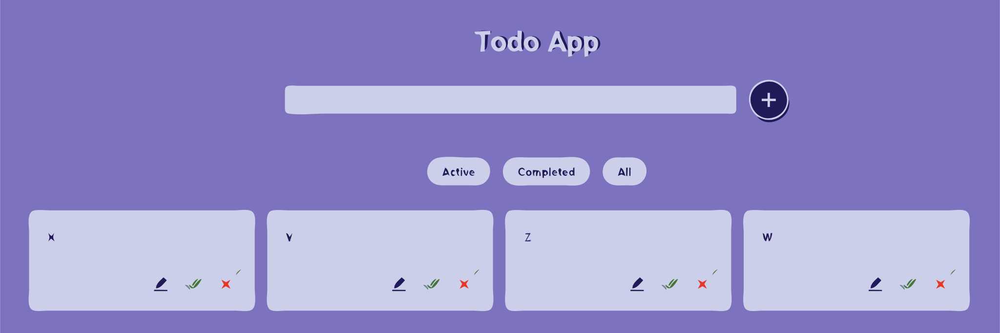

## 💻 Project

This project was bootstrapped with [Building a Todo List App with Redux](https://github.com/facebook/create-react-app).

The page will reload when you make changes.\
You may also see any lint errors in the console.

<!-- <p align="center">
  
</p> -->

<p align="center">
  
</p>

<h1 align="center">
    
</h1>

<br>

## 🧪 Technologies

This project was developed with these technologies:

- [React](https://reactjs.org)
- [Redux](https://redux-toolkit.js.org/)

## 🚀 How execute

Clone the project and access itself folder.

```bash
$ git clone https://github.com/Vitor0liveira/todolist-frontend.git
$ cd todolist-frontend
```

To start it, follow steps below:

```bash
# Install the dependencies
$ npm

# Start the project
$ npm start

The app will be able to browser through address: http://localhost:3000.
```
